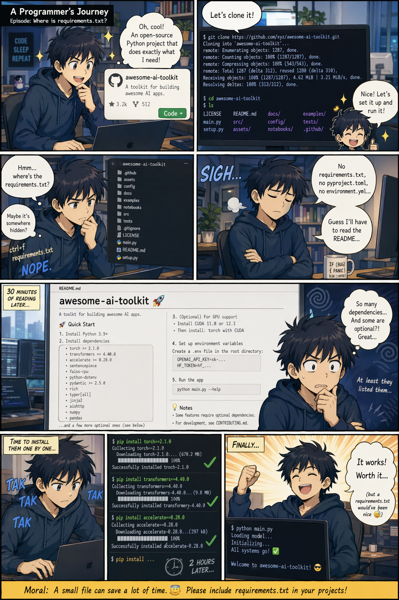
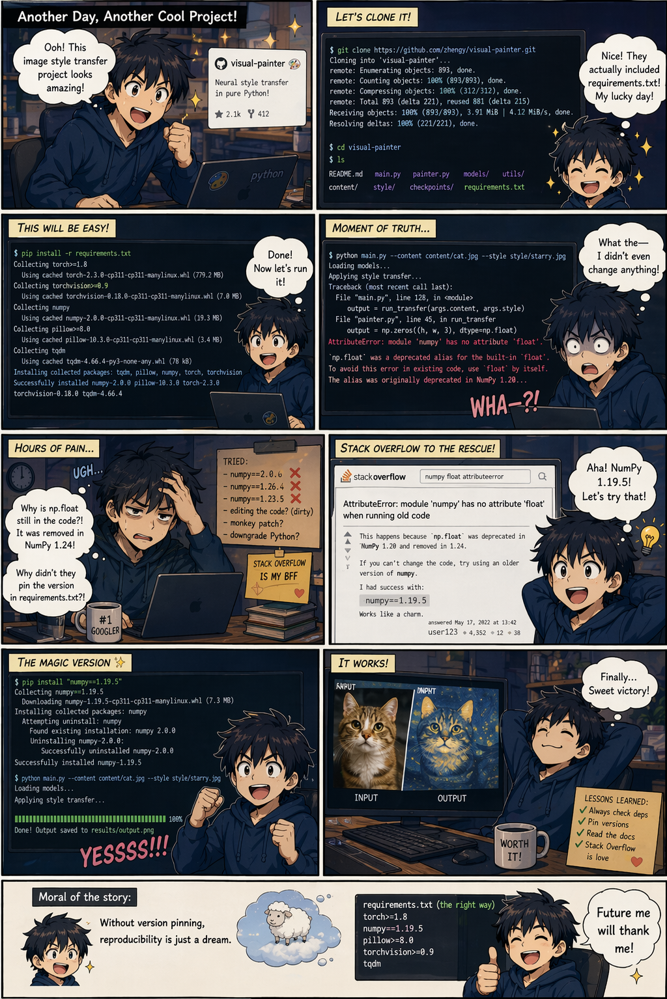
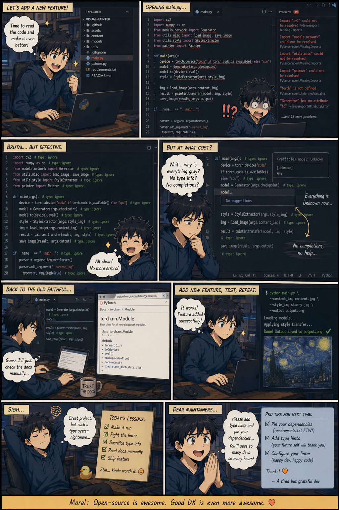

# Why Python Sucks

> [!NOTE]
> Disclaimer: Images [created with AI](https://chatgpt.com/share/69e85c28-b450-83ea-af3a-4ae8505c1fb8).

It does not generate a `requirements.txt` file for a project automatically.

It does not pin dependencies by default, and `import` names and `pip install` names are not always the same.

VERY poor IDE support.

