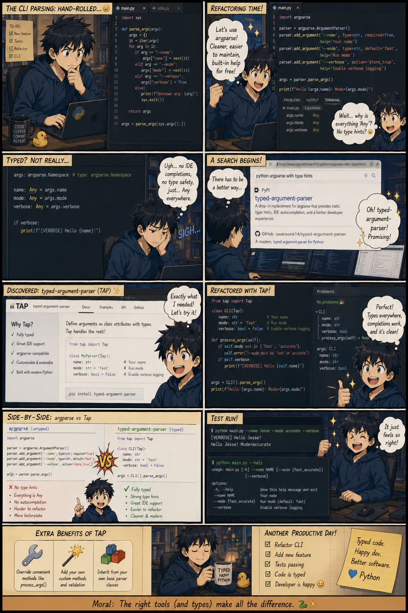
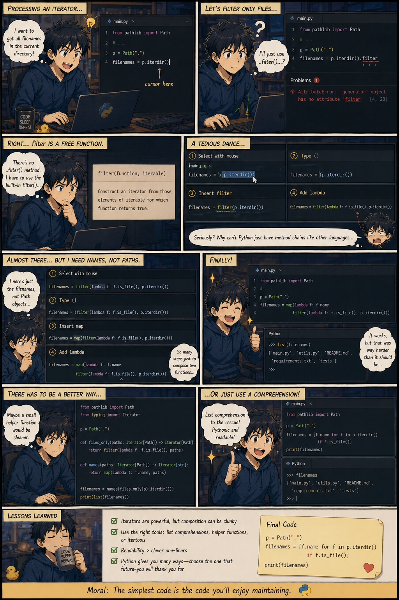
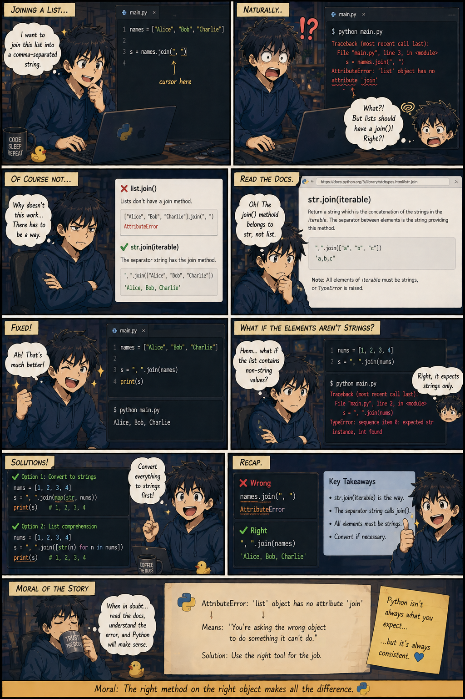

# Why Python Sucks

> [!NOTE]
> Disclaimer: Images [created with AI](https://chatgpt.com/share/69e85c28-b450-83ea-af3a-4ae8505c1fb8).

## Dependency

It does not generate a `requirements.txt` file for a project automatically.

It does not pin dependencies by default, and `import` names and `pip install` names are not always the same.

## Typing

VERY poor IDE support.

`argparse` is not typed.

Consider using [typed-argument-parser](https://github.com/swansonk14/typed-argument-parser) instead.

## API Design

Free function instead of methods.

(You still need to cope with iterators if the list is large)

str.join instead of list.join.

<!--## Importing-->

<!-- Circular import: ImportError: cannot import name 'SomeClass' from partially initialized module 'some_module' (most likely due to a circular import) -->

<!-- Unresolved imports -->
