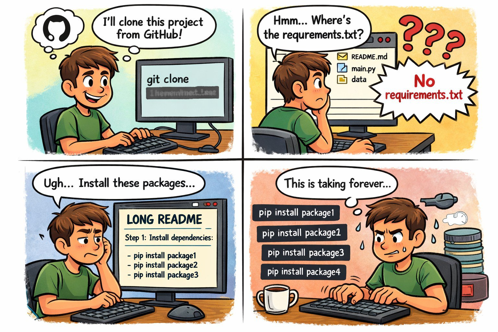
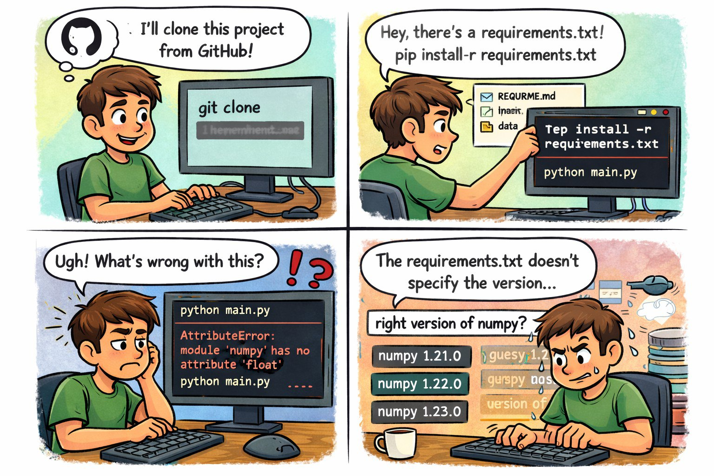
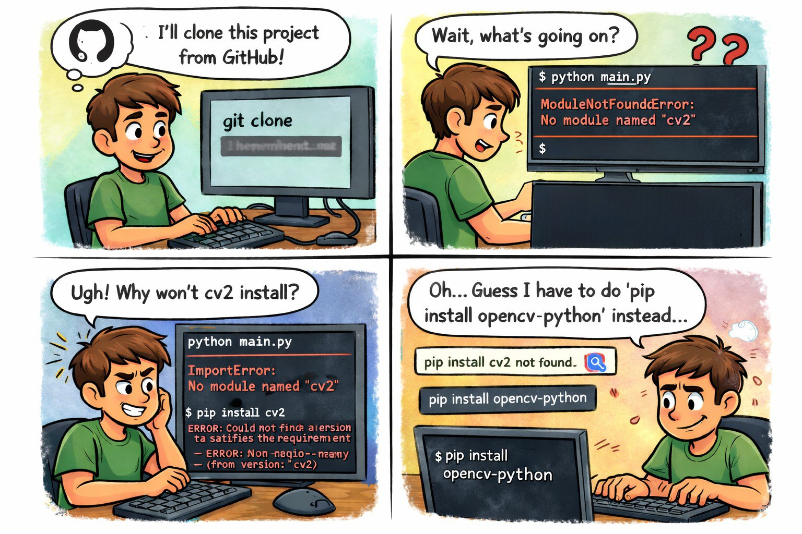
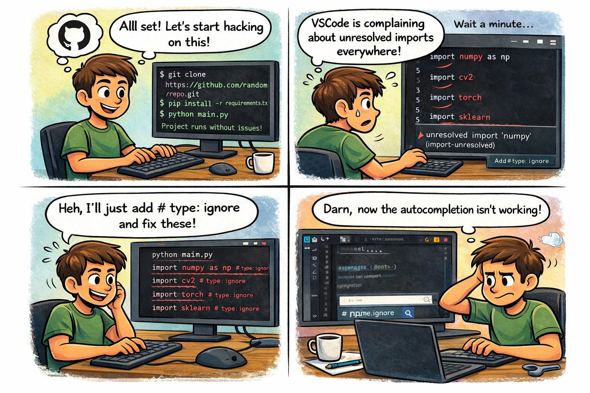

# Why Python Sucks

> [!NOTE]
> Disclaimer: Images created with AI.

It does not generate a `requirements.txt` file for a project automatically.

It does not pin dependencies by default.

`import` names and `pip install` names are not always the same.

VERY poor IDE support.

