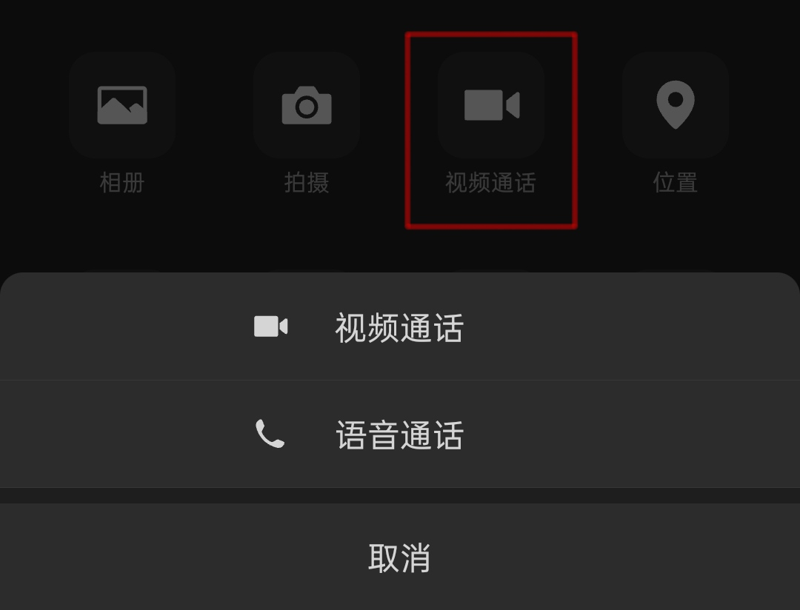
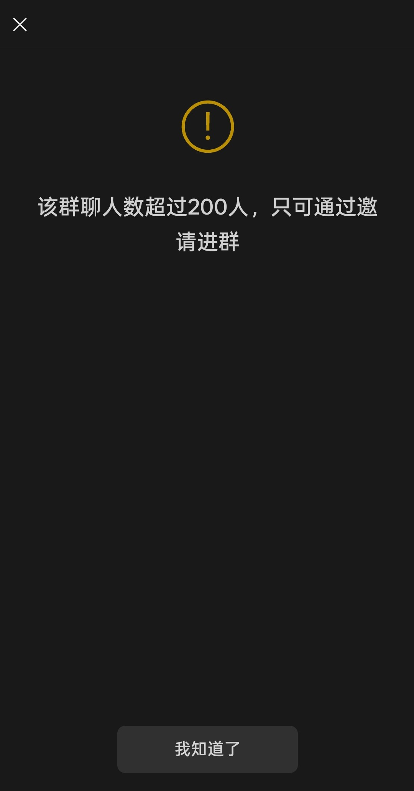
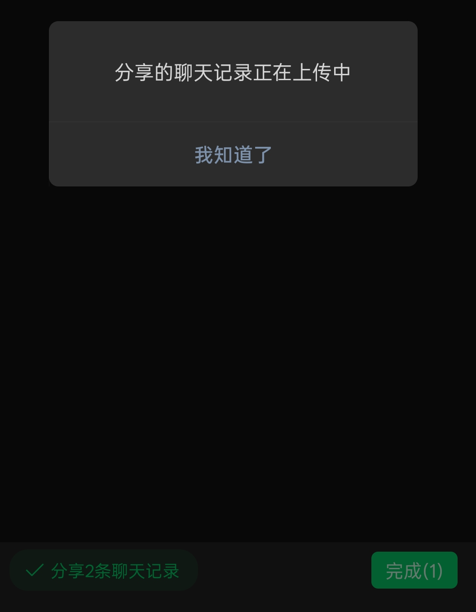
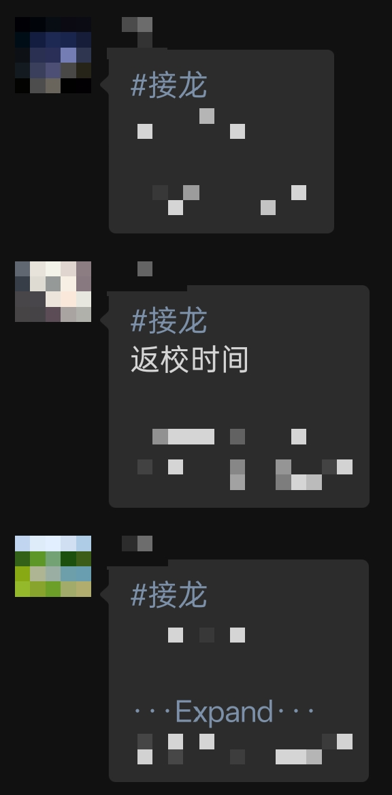

# Why WeChat Sucks

Voice call is grouped under video call.

You need invitation to join groups larger than 200 members.

There's no cloud chat history.

You'll have to upload your copy of chat history to share with others. Maybe there IS cloud history, but it's not available to users.

Stupid "group note" feature.

This is used to count participants in a group. The idea is that members can send a message indicating that they'll participate, and the tool'll gather a list of participants. But it clutters the chat history a lot and notifies everyone just like any other message.

